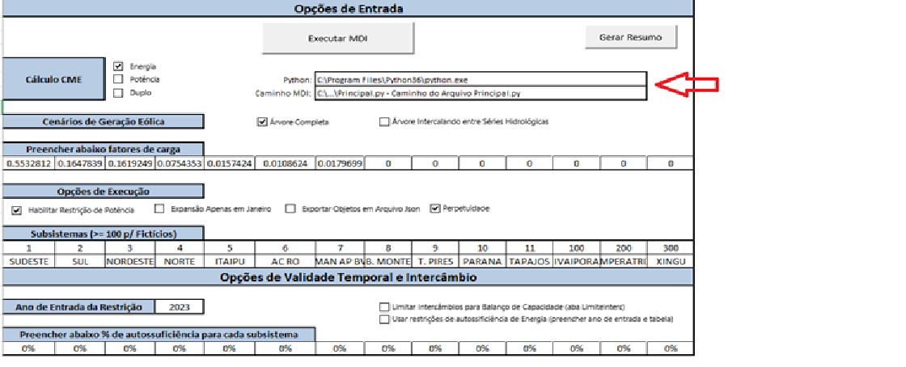

# PROJETO MDI EPE - PDE 2030

https://github.com/renan2scarvalho/MDI_PDE_2030


# Instalação dos pacotes

Para a instalação dos pacotes, é recomendável primeiramente instalar o pacote `pywin32` antes da instaçãoa do pacote `pypiwin32`.
A instalação, caso não seja bem sucedida, pode ser realizada através dos arquivos wheel, encontrados em: https://www.lfd.uci.edu/~gohlke/pythonlibs/


# Instruções Básicas do Modelo Computacional MDI

## Introdução

O modelo computacional MDI (modelo de decisão de investimentos), empregado na elaboração do Plano Decenal de Expansão de Energia 2030 (PDE 2030), é disponibilizado em código-fonte aberto para permitir máxima transparência na modelagem matemática e implementação. Esta disponibilização também permite que instituições, centros de pesquisa e agentes do setor, bem como a comunidade acadêmica, possam contribuir efetivamente para o aprimoramento do modelo.

Pré-requisitos mínimos:
- Python 3.x (Windows)
- Bibliotecas da própria linguagem importadas ao longo do código ;
- Coopr
- pypiwin32
- Pyomo
- DateTime
- Jsonpickle
- Openpyxl
- Xlrd
- Xlwt
- python-dateutil
- Pacote de otimização (CPLEX, COIN-OR, Gurobi, etc).

Ambiente computacional utilizado nos estudos do PDE 2030
•	Python 3.8
•	CPLEX Studio 12.9
•	MS Windows Server 2012 R2
•	MS Excel 2013

# Instruções básicas para execução

## Interface para execução

A execução é feita a partir da pasta de trabalho MS Excel `Dados_MDI_PDE_2030.xlsx` (disponibilizada junto com o código-fonte), que também contém todos os dados necessários para a montagem do problema de otimização resolvido pelo MDI.

## Configurações Iniciais

Inicialmente é necessário configurar o caminho para o pacote de otimização, editando-se o arquivo “Control.py” (linha 36), conforme figura a seguir:


```py
        # habilita o cplex
        optsolver = SolverFactory("cplex", executable= "C:\\Program Files\\IBM\\ILOG\\CPLEX_Studio129\\cplex\\bin\\x64_win64\\cplex.exe");
        print ("Modelo Criado");
        self.problema.modelo.preprocess();
        print ("Pre-process executado");
```

Em seguida, é necessário configurar, na planilha “Inicial” da pasta de trabalho “Dados_MDI_PDE_2030.xlsx”, o caminho completo do arquivo “Principal.py”, que deve estar salvo na mesma pasta dos demais arquivos de código-fonte. Outra informação declarada nesta planilha é o executável do Python 3.x, conforme destacado na figura a seguir:



# Execução

A execução é feita a partir do botão “Executar MDI” disponível na mesma planilha onde foram feitas as configurações iniciais.

# Saídas

As saídas (em formato texto) são geradas no mesmo caminho onde se encontra a pasta de trabalho que iniciou a execução.
A pasta de trabalho “Resumo.xlsx”, que deve também estar no mesmo caminho, ao final da execução, será preenchida com o resumo da expansão bem como os valores de CME solicitados anualmente.

# Contato

Para comentários, dúvidas e sugestões sobre o MDI, favor enviar e-mail para modelos.sgr@epe.gov.br.

